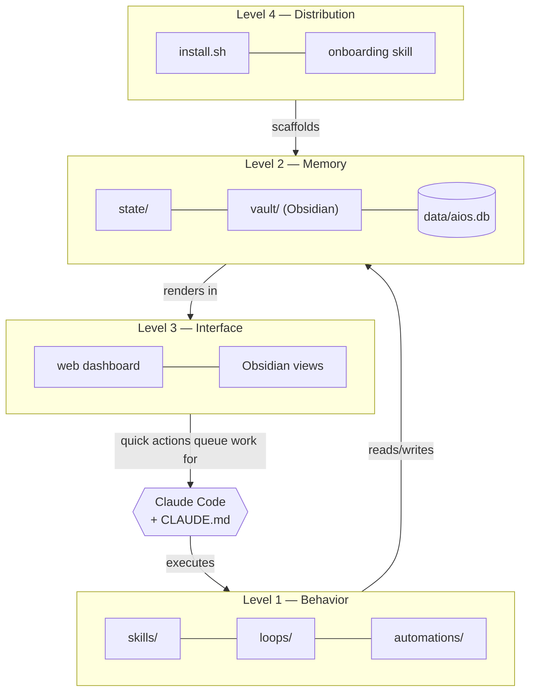

# AIOS — an Agentic OS for AI-assisted work

A complete, file-based operating system for working with
[Claude Code](https://claude.com/claude-code): your workflows become versioned
**skills**, your context becomes on-disk **state** that survives any session,
your day gets a **dashboard**, and the whole thing is a repo anyone can clone
and personalize.

Built game-developer-first (build-test-fix loops, bug triage, playtest
feedback, dev logs, release notes) but the framework is domain-agnostic.

## Philosophy

1. **Behavior lives in skills, not in your head** — every repeatable workflow
   is a documented `SKILL.md` any session can execute.
2. **State lives in files, not in chat context** — a fresh session with zero
   memory resumes your work purely from disk.
3. **Loops over one-shots** — plan → act → verify → checkpoint, with specs in
   `loops/` that make iteration resumable.
4. **Plain text and Markdown first** — greppable, portable, yours.
5. **Distribution-ready** — personal data is gitignored by construction; the
   repo itself is a generic framework.

## The 4 levels



- **Level 1 — keeps behavior:** `skills/` (one contract per workflow),
  `loops/` (iteration + checkpoint specs), `automations/` (scheduled scripts),
  `CLAUDE.md` (how any session operates here).
- **Level 2 — keeps state:** `state/` (focus, session log, open loops),
  `vault/` (Obsidian long-term memory), `data/aios.db` (SQLite via
  `scripts/db.py`).
- **Level 3 — keeps access:** local web dashboard with live panels and
  quick-action buttons that queue work for Claude; Dataview dashboards inside
  the vault reading the same state.
- **Level 4 — keeps it for others:** installer, docs, and an onboarding skill
  that interviews a new user and personalizes everything.

## Quickstart

```bash
git clone https://github.com/misha290509/agentic-os.git && cd agentic-os
./install.sh                 # scaffolds state, DB, config — interactive
claude                       # start Claude Code in the repo root
> onboard me                 # first time: personalizes the OS for you
> resume where we left off   # every time after: full context from disk
```

Dashboard: `python3 scripts/serve_dashboard.py` → http://127.0.0.1:8321
Obsidian: open `vault/` as a vault (Dataview plugin recommended).

<!-- screenshot: docs/img/dashboard.png -->
<!-- screenshot: docs/img/obsidian-home.png -->

## Requirements

- Claude Code, `git`, `python3` (3.8+, stdlib only — no pip installs), `bash`
  (macOS/Linux; Git Bash or WSL on Windows)
- Optional: Obsidian + Dataview for the vault views

## Learn more

| Doc | Contents |
|---|---|
| [docs/getting-started.md](docs/getting-started.md) | Step-by-step first hour |
| [docs/file-structure.md](docs/file-structure.md) | Every directory's purpose |
| [docs/workflow-audit.md](docs/workflow-audit.md) | The workflow analysis that shaped the skills |
| [docs/data-model.md](docs/data-model.md) | SQLite schema + CLI |
| [docs/customization.md](docs/customization.md) | Dashboard panels, actions, theming |
| [CONTRIBUTING.md](CONTRIBUTING.md) | Adding skills/automations properly |

## License

MIT — see [LICENSE](LICENSE).
